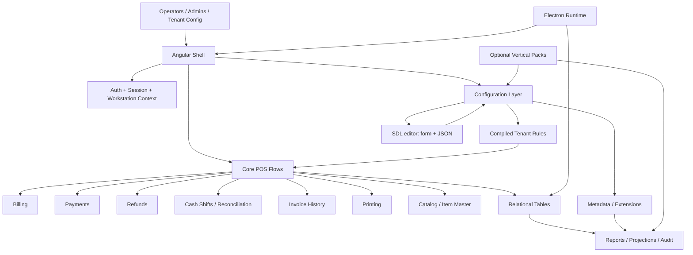

# Target Architecture Rebuild Charter

Status: closed historical architecture charter
Closed: 2026-08-06

> **AI development rule:** The architecture decisions in this charter have been
> implemented to the agreed scope. Use it only as a boundary reference; do not
> treat its phases or future-looking items as active work. New product features
> need their own scoped plan.

This document is the blunt companion to `living-phase-map.md`.
Use it as a durable decision record for the next rebuild cycle so both humans
and AI can check whether the work is still on track.

It answers four questions:

- What should the platform become?
- What should stop being special?
- What must remain core and stable?
- How do we know each iteration is moving in the right direction?

## Short Verdict

This repo does **not** need a demolition rebuild.
It needs a **controlled refactor into a stable POS kernel** with a few
carefully bounded extension points. Full shared-backend multi-tenancy is future
work, not part of the current one-business-per-installation deployment.

Keep the current core product shape:

- UI shell
- billing
- multi-payment completion
- printing
- refunds
- invoice history
- users and roles
- cash shifts and reconciliation
- settings
- workstations and billing dates
- item management

Replace the current overreach:

- plugin-driven core behavior everywhere
- per-transaction scanning of all active plugins
- SDL acting like a universal runtime override system
- critical operational data trapped only in JSON metadata

## Target Architecture

### Reading the diagram

- The **core POS flows** are fixed and deterministic.
- The **configuration layer** is editable, validated, and compiled ahead of use.
- The **compiled tenant rules** influence the core, but only through defined
  hooks.
- **Relational tables** store operational truth.
- **Metadata** stores optional or tenant-specific variation, not the whole
  model.
- **Vertical packs** add defaults, reports, and domain-specific surfaces, but
  they do not get to rewrite the kernel at runtime.

## Core Rules

1. Transaction paths must be predictable.
2. Critical financial flows must not depend on scanning every active plugin.
3. Anything that must be queried often should have a real column or a dedicated
   projection table.
4. JSON metadata is allowed, but it is not the default home for important data.
5. SDL is a configuration and calculation system, not a universal behavior bus.
6. The shell can be modular, but the ledger must remain boring.

## What Stays Core

Keep these in the core kernel:

- authentication
- store/workstation context; tenant configuration scope is retained as
  future-ready groundwork only
- session restore and login
- billing and invoice creation
- payment completion, including multi-payment
- refunds
- cash shifts and reconciliation
- printer selection and document generation
- invoice history and reprint
- users, roles, and permissions
- product/item master
- settings and operational preferences
- audit logs and reports

These are the parts that must stay fast, explainable, and testable.

## What Changes

### 1. SDL becomes a bounded configuration layer

Keep the form-and-JSON editor.
Keep the database-backed SDL view.
Keep the ability to configure fields, calculations, and receipt placement.

Change the runtime model so SDL is compiled into a tenant-specific rule set
instead of being interpreted through all active plugins on every transaction.
Runtime billing hooks may still exist, but they are gated by the compiled
tenant snapshot and must default to off unless the tenant explicitly enables
them.

Each compiled snapshot must declare the effect areas it is permitted to use,
such as field rendering, input validation, receipt layout, line calculation,
or bill calculation. This is an allow-list, not a discovery mechanism.

Use SDL for:

- optional fields
- field visibility
- validation rules
- calculated totals
- receipt placement
- defaults
- lightweight domain behavior

Do not use SDL for:

- every transaction decision
- plugin-to-plugin behavior orchestration at runtime
- hidden cross-module overrides
- replacing core ledger logic

### 2. Plugins become vertical packs, not runtime governors

Plugins should:

- provide defaults
- expose optional screens and reports
- register bounded extension points
- contribute domain-specific configuration

Plugins should not:

- own the billing kernel
- rewrite the payment flow
- compete to define the same transaction outcome
- force every action through all installed extensions

### 3. Important data gets promoted out of metadata

If a field is used for querying, filtering, reporting, reconciliation,
validation, or accounting, it should eventually move out of pure JSON metadata
into one of these forms:

- a normal table column
- a child table
- a materialized projection
- a stored derived summary

Metadata stays for:

- custom display-only fields
- tenant-specific extras
- low-volume optional values
- UI configuration details

### 4. Configuration compilation becomes explicit

Instead of asking the runtime to rediscover everything on every transaction,
make configuration change follow this pattern:

1. Edit configuration.
2. Validate SDL.
3. Compile or normalize the tenant rules.
4. Persist the resulting config snapshot.
5. Load the snapshot into runtime caches.
6. Apply the cached rules in the core flow.

That makes the system easier to debug and cheaper to operate.

## What Gets Removed

Remove or sharply reduce these patterns:

- runtime scanning of all plugins for every key action
- plugin-controlled core business logic
- vague cross-plugin dependencies
- fields that only exist in JSON even though they are operationally important
- duplicated definitions of the same transaction concept in multiple plugins
- any architecture where the shell cannot explain the source of truth for a
  value

## Keep / Change / Remove

### Keep

- existing Angular shell structure
- login and workstation flows
- billing screen layout and flow
- multi-payment completion
- thermal printing engine
- refunds and invoice history
- user/role admin screens
- cash management and reconciliation
- settings page UX
- item management
- the SDL editor pattern with form + JSON views
- seeing SDL stored in the database

### Change

- make SDL a system-level configuration layer
- compile SDL to tenant rules instead of consulting every plugin repeatedly
- introduce table-backed structures for high-value operational fields
- reduce plugin influence to explicit extension points
- separate core transactional truth from optional tenant customization
- treat vertical packs as bounded domain packages

### Remove

- anything that makes core transactions depend on all active plugins
- anything that forces dynamic evaluation before every financial action
- plugin-first ownership of billing math
- excessive metadata-only modeling for fields that should be queryable
- ambiguous behavior where the same action can resolve differently depending on
  plugin order

## Migration Plan

### Phase 1: Freeze the current core shape

Goal: stop the architecture from expanding in the wrong direction.

- Keep the current working screens.
- Stop adding new plugin-driven behaviors unless they are truly bounded.
- Document the current source of truth for every transactional area.
- Identify which current fields are operationally important.

Exit check:

- A new developer can explain the core business flow without reading plugin
  code first.

### Phase 2: Split core truth from config truth

Goal: separate ledger data from tenant customization.

- Move important searchable fields into tables or child tables.
- Keep JSON for optional extension data only.
- Define the canonical columns for billing, refunds, cash, invoices, and item
  master records.
- Introduce explicit projection tables where reporting needs them.

Exit check:

- Common reports can run without decoding everything from metadata.

### Phase 3: Constrain SDL

Goal: make SDL safe and understandable.

- Keep the editor.
- Keep the DB representation.
- Add a compilation step from SDL to tenant configuration.
- Make the runtime consume the compiled result.
- Limit SDL influence to documented areas only.

Exit check:

- A transaction path can point to the exact compiled rule set that affected it.

### Phase 4: Convert plugins into vertical packs

Goal: turn plugins into controlled business modules.

- Each pack can ship defaults and reports.
- Each pack can expose its own configuration UI.
- Each pack can own its domain-specific projections.
- Pack behavior must still be bounded by the core contract.

Exit check:

- More than one pack can exist without making the core transaction path
  ambiguous.

### Phase 5: Add tenant-safe reporting and audits

Goal: make the system usable as a SaaS.

- Add tenant-aware reporting views.
- Make audit trails explicit and durable.
- Ensure every financial action can be explained after the fact.
- Keep migration and config versioning visible.

Exit check:

- Support can answer “why did this happen?” without inspecting raw plugin logic.

## Decision Rules For New Work

Use these rules before accepting any new feature:

1. Does this belong in the kernel, a pack, or tenant config?
2. Does this need to be queryable later?
3. Does this change the financial truth or only the presentation?
4. Can this be compiled once instead of reevaluated every time?
5. Does this introduce plugin ordering dependence?

If the answer is unclear, the feature is probably too broad.

## Audit Checklist

At the end of every iteration, confirm:

- core billing still works without plugin chaos
- payment completion is deterministic
- refunds do not depend on changing configuration midstream
- cash reconciliation still has a clear ledger trail
- invoice history can be queried without metadata spelunking
- SDL edits still produce a readable and stored configuration snapshot
- no new feature forced a transactional flow to depend on all plugins

## Repository-Level Migration Ledger

Use this repo as the source of truth for the rebuild transition:

- [`docs/architecture/living-phase-map.md`](./living-phase-map.md) for the
  current state of the system and the phase history.
- This document for the rebuild target and the keep/change/remove plan.
- Feature-specific integration notes for module-level contracts.

## Final Judgment

This is a good base to keep.

It is **not** the right time to throw it away.
It is the right time to:

- cut the plugin surface back to bounded extension points,
- keep SDL as a disciplined config system,
- promote important data out of metadata,
- and stabilize the core as a tenant-safe POS kernel.

If the repo stays on this track, it becomes easier to support, easier to
report on, easier to test, and much more believable as a multi-tenant POS
SaaS.
